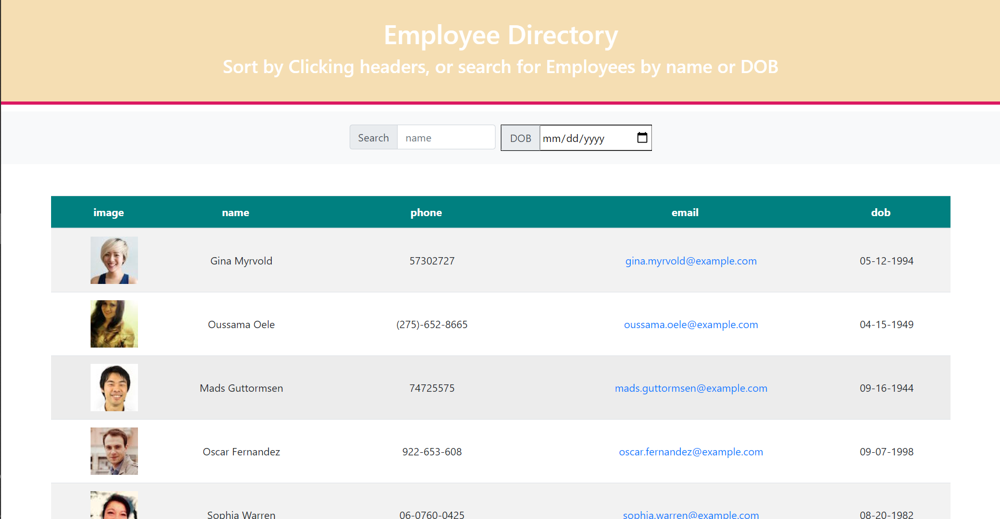

# Employee-Directory-v2

    <h4>
    </a>
    
    
        
    </h4>

 

This is an employee directory application.

  <h4>
    <a href="https://github.com/ThomasMullaney/Employee-Directory-v2">
      Github Repository
    </a>
 | 
<a href="https://thomasmullaney.github.io/Employee-Directory-v2/">
      Github Pages
    </a>
  </h4>

## Description:
### A project creating a randomly generated employee database. Users are able to search for an employee by name or DOB, and sort results by multiple factors by clicking on the corresponding headers.

## Table of Contents:
     
1. [Installation](#installation)
2. [Usage](#usage)
3. [License](#license)
4. [Contributing](#contributing)
5. [Tests](#tests)
6. [Questions](#questions) 

## Installation: 
### npm install && npm start

## Usage:
### The application is designed to allow an employee or manager to view an employee directory. When the user loads the page, a table of employees is displayed allowing the user to sort by name, phone, email or DOB. The user can also filter by name or DOB via the search fields.

## License:
### 
    
## Contributing:
### Tom Mullaney

## Tests:
### 

    
## Questions:
### github.com/ThomasMullaney
### tloring.mullaney@gmail.com
    
